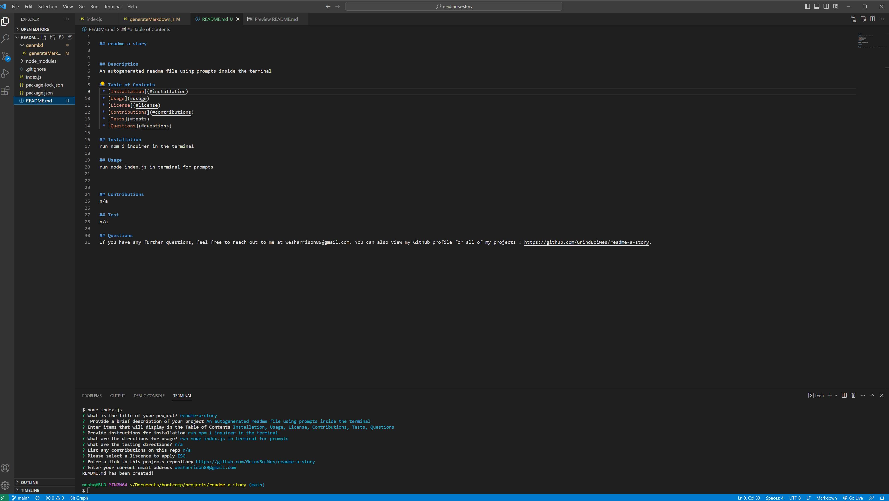

## readme-a-story

  
## Description
An autogenerated readme file using prompts inside the terminal. This repo is using the npm inquirer, and through the prompts given by running node index.js, you will answer questions that will turn your responses into a README.md file.
  
## Table of Contents
 * [Installation](#installation)
 * [Usage](#usage)
 * [License](#license)
 * [Contributions](#contributions)
 * [Tests](#tests)
 * [Questions](#questions)
    
## Installation
run npm i inquirer in the terminal
  
## Usage 
run node index.js in terminal for prompts

## License
This repository is licensed under the [ISC](https://opensource.org/licenses/ISC) license.

## Contributions
n/a
  
## Test
n/a
  
## Questions
If you have any further questions, feel free to reach out to me at wesharrison89@gmail.com. You can also view my Github profile for all of my projects : https://github.com/GrindBoiWes?tab=repositories.

## Screenshot

## Links

* Github : https://github.com/GrindBoiWes/readme-a-story 
* Website : https://grindboiwes.github.io/readme-a-story/
* Google Drive (video) : https://drive.google.com/file/d/1NuwLUi_EuY-1RaC5FQhrXxUZfR2K42Ws/view
